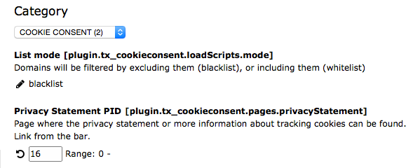

.. ==================================================
.. FOR YOUR INFORMATION
.. --------------------------------------------------
.. -*- coding: utf-8 -*- with BOM.

.. include:: ../../Includes.txt

.. _constants:

Constants
^^^^^^^^^

The constants properties can be defined by editing them with the Constant Editor.

#. Go to the module WEB > Template.

#. In the page tree, select a page where a TypoScript template is located, mostly the root page of your website.

#. In the upper left corner of the module, select 'Constant Editor' from the dropdown.

#. Under 'Category' select 'COOKIE CONSENT (2)' from the dropdown.

   Editing properties in the Constant Editor

You also can define the constants in the “Constants” field of your TypoScript templates.

.. _constants-plugin-cookie-consent-pages:

plugin.tx\_cookieconsent.pages
""""""""""""""""""""""""""""""

.. _constants-plugin-cookie-consent-pages-privacystatement:

privacyStatement
~~~~~~~~~~~~~~~~~

.. container:: table-row

   Property
         privacyStatement

   Data type
         int

   Description
         Page ID where the privacy statement or more information about tracking cookies can be found. This will be
         presented as a link on the bar.

   Default
         0

.. _constants-plugin-cookie-consent-loadscripts:

plugin.tx\_cookieconsent.loadScripts
""""""""""""""""""""""""""""""""""""

.. _constants-plugin-cookie-consent-loadscripts-mode:

mode
~~~~

.. container:: table-row

   Property
         mode

   Data type
         string

   Description
         Only 2 options are possible: blacklist / whitelist. Domains will be filtered by excluding them (blacklist),
         or including them (whitelist)

   Default
         blacklist

.. note::

   Declaring the domains which should be used in the white- or blacklist is not possible in constants.
   These must be declared in the setup of your TypoScript Template.