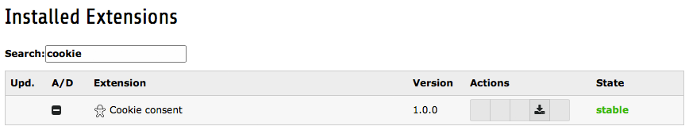

.. ==================================================
.. FOR YOUR INFORMATION
.. --------------------------------------------------
.. -*- coding: utf-8 -*- with BOM.

.. include:: ../Includes.txt

.. _installation:

Installation
------------

.. _extension-manager:

Extension Manager
^^^^^^^^^^^^^^^^^

#. Go to the module ADMIN TOOLS > Extensions.

#. In the upper left corner of the module, select 'Get Extensions' from the dropdown.

#. Click on the button 'Update now'. The list of available extensions on the TYPO3 Extension Repository (TER) will be
   downloaded. This can take a while.

#. When the list is downloaded, search for 'cookie_consent'.

#. Click on the '+' icon in front of the extension name. The extension will be installed.

   Verifying that cookie_consent is loaded in the Extension Manager

.. _web-template:

Web > Template
^^^^^^^^^^^^^^

.. note::

    No static template has to be included in a system template. This is done automatically by using
    ext_typoscript_constants.txt and ext_typoscript_setup.txt in the root of the extension. The settings will be loaded
    and Javascript and CSS will be included in the output.

.. _your-template:

Inserting cookie_consent into your template
"""""""""""""""""""""""""""""""""""""""""""

Adding the information bar to your website is simple:

::

   page = PAGE
   page {
       10 < plugin.tx_cookieconsent

       20 = FLUIDTEMPLATE
       20 {
           ...
       }
   }

This will add the HTML of the information bar right after the opening :code:`<body>` tag. It will also insert the
configuration as a Javascript object to the :code:`<head>` of the page.

.. note::

    If you are defining your :code:`page = PAGE` TypoScript from within an extension using ext_typoscript_setup.txt as
    well, be aware of the loading order of the extensions. The extension cookie_consent has to be loaded prior to your
    extension, defining :code:`page = PAGE`.

Removing cookie_consent from your template when the user made its choice
""""""""""""""""""""""""""""""""""""""""""""""""""""""""""""""""""""""""

When not using the frontend javascript to exclude dynamic loading of scripts, you can remove the cookie bar completely
when the user has made its choice. This way your frontend markup will stay clean and not include the markup for the
cookie bar, inclusing its javascript functionality.

To do this, add a condition to the TypoScript as mentioned above, like this:

::

   [PatrickBroens\CookieConsent\TypoScript\Conditions\DoNotTrackCondition]
      page.10 >
   [global]

.. WARNING::

   Only do this when you are not using the frontend javascript functionality to exclude dynamically loaded scripts.