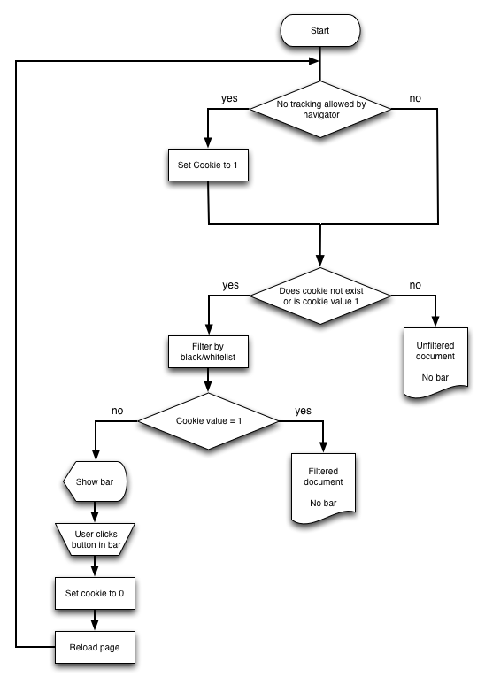

.. ==================================================
.. FOR YOUR INFORMATION
.. --------------------------------------------------
.. -*- coding: utf-8 -*- with BOM.

.. include:: ../../Includes.txt

.. _what-does-it-do:

What does it do?
----------------

Cookie Consent stops extensions from adding 3rd party tracking code and cookies to your website to protect your
visitor's privacy. When a visitor enters the website for the first time, it will check the following and take action
upon:

#. First it will check if the browser setting DNT should be taken into account. This can be configured.

#. If so, do the browser settings allow tracking? If not, the "doNotTrack" cookie will be set to 1

#. If the "doNotTrack" cookie is not set yet, it will present an information bar to the visitor, with a description, a
   link to a page with the privacy statement and a button to accept tracking. When accepted, the "doNotTrack" cookie is
   set to 0.

The extension contains a TypoScript condition to add or remove code from your markup, like javascript inclusions.
It can also be used to pass settings to another extension, which can use it to do the same.

Secondly frontend javascript can be used to prevent the loading of scripts, images or iframes (using a slightly modified
version of jQuery AOP) which are added to the DOM. These elements can be excluded from the DOM by checking the url of
the source of this element. This url will be compared with domains in a white- or blacklist, depending on the mode
setting.

You can use only the TypoScript condition, the frontend javascript or a combination of both.

.. WARNING::

   The extension will only check :code:`<script>`, :code:`<iframe>` and :code:`` tags which are added to
   the DOM by Javascript. No checking will be done on these tags if they are already in the page source itself. You have
   to exlude these by using the TypoScript condition.

.. _what-does-it-do-flowchart:

Flow Chart
^^^^^^^^^^

   Flow chart how 'Do Not Track' and consent are handled